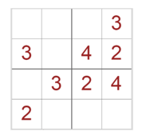

```{r setup, include=FALSE}
knitr::opts_chunk$set(echo = TRUE,cache=TRUE)

mimacbookpro15=FALSE # mimacbookpro15, macmini
if (mimacbookpro15) {
  ampl.dir = "/Users/calvo/Documents/maqvirvm_Win8164bits/doctrabajo/apliterminal/ampl/ampl.macosx64_2017mayo/"  
  glpsol.dir = "/Users/calvo/Documents/maqvirvm_Win8164bits/doctrabajo/apliterminal/GLPK/"
} else {
  ampl.dir = "/Applications/apliterminal/ampl/ampl.macosx64_2017mayo/"  
  glpsol.dir = "/Applications/apliterminal/GLPK/"
}

source("funcionesAMPL.R")
```

# Ejercicio: modelo aleatorio

```{r}
modelo = '
param nvar;
param nres = 15;
set VARIABLES:= 1..nvar;
set RESTRICCIONES := 1..nres;

param c {VARIABLES} := trunc(Uniform(-10,10));

param A {RESTRICCIONES,VARIABLES} := trunc(Uniform(-20,20));
param b {RESTRICCIONES} := trunc(Uniform(10,100));

var x {VARIABLES} >=0, <= 10;

maximize z: 
   sum {i in VARIABLES} c[i]*x[i];

s.t. rest {j in RESTRICCIONES}:
   sum {i in VARIABLES} A[j,i]*x[i] <= b[j];
'


data=''

run = '
reset;
#option solver cplex;
option solver "./cplex";
model aleatorio.mod;
let nvar := 20;
solve;
display x,z > sal02.txt;

for {ii in 20..30} {
   let nvar := ii;
   printf "Problema con ii igual a %d \\n",ii;
   printf "Problema con ii igual a %d \\n",ii >> sal02.txt;
   solve;
   display x,z >> sal02.txt;
   expand >> sal02.txt;
}
fix x[3] := 5;  # fija la variable sin eliminarla
drop rest[15];
solve;
display x,z >> sal02.txt;
expand >> sal02.txt;
'

func_ampl_moddatrun_mac(v_mod = modelo,
                    v_dat = data,
                    v_run = run,
                    fic.mod = "aleatorio.mod",
                    fic.dat = "aleatorio.dat",
                    fic.run = "aleatorio.run")

```


# Ejercicio 4.11


Ver introducción de datos en ampl: <http://ampl.com/BOOK/CHAPTERS/12-data.pdf>


```{r}
modelo = '
param nuTrabajadores;
param nuTareas;
set TAREAS := 1..nuTareas;
set TRABAJADORES := 1..nuTrabajadores;
param coste {TRABAJADORES};
param cualificacion {TAREAS,TRABAJADORES} binary;
var Quien {TAREAS,TRABAJADORES} binary;

minimize z: 
   sum {i in TAREAS,j in TRABAJADORES} coste[j]*Quien[i,j];
s.t. r1 {j in TRABAJADORES}:
   sum {i in TAREAS} cualificacion[i,j]*Quien[i,j] <= 1;
s.t. r2 {i in TAREAS}:
   sum {j in TRABAJADORES} cualificacion[i,j]*Quien[i,j] = 1;

'

data = '
param nuTrabajadores:=32;
param nuTareas:=15;
param coste:=
1 1 
2 1
3 1
4 1
5 1
6 1
7 1
8 1
9 2
10 2
11 2
12 2
13 2
14 2
15 2
16 3
17 3
18 3
19 3
20 4
21 4
22 4
23 4
24 5
25 5
26 6
27 6 
28 6 
29 6
30 7
31 8
32 9;
param cualificacion default 0 := 
[1,*] 1 1 9 1 19 1 22 1 25 1 28 1 31 1
[2,*] 2 1 12 1 15 1 19 1 21 1 23 1 27 1 29 1 30 1 31 1 32 1
[3,*] 3 1 10 1 19 1 24 1 26 1 30 1 32 1
[4,*] 4 1 21 1 25 1 28 1 32 1
[5,*] 5 1 11 1 16 1 22 1 23 1 27 1 31 1
[6,*] 6 1 20 1 24 1 26 1 30 1 32 1
[7,*] 7 1 12 1 17 1 25 1 30 1 31 1
[8,*] 8 1 17 1 20 1 22 1 23 1
[9,*] 9 1 13 1 14 1 26 1 29 1 30 1 31 1
[10,*] 10 1 21 1 25 1 31 1 32 1 
[11,*] 14 1 15 1 18 1 23 1 24 1 27 1 30 1 32 1
[12,*] 18 1 19 1 22 1 24 1 26 1 29 1 31 1
[13,*] 11 1 20 1 25 1 28 1 30 1 32 1
[14,*] 16 1 19 1 23 1 31 1
[15,*] 9 1 18 1 26 1 28 1 31 1 32 1
;

'


run = '
reset;
model ejercicio_4_11.mod;
data ejercicio_4_11.dat;
option solver "./cplex";
solve;
display Quien,z;

printf "\\nQuien:\\n";
for{i in TAREAS} {
  printf "Tarea %2d: ", i;
  for {j in TRABAJADORES} {
    if Quien[i,j]>=1 then
       printf "Trabajador %2d, con coste: %2d\\n", j,coste[j]; 
  }
  
}

printf "\\n";

'

func_ampl_moddatrun_mac(v_mod = modelo,
                    v_dat = data,
                    v_run = run,
                    fic.mod = "ejercicio_4_11.mod",
                    fic.dat = "ejercicio_4_11.dat",
                    fic.run = "ejercicio_4_11.run")


```


# Ejercicio sudoku usando ficheros


```{r}
modelo = '
# fichero ampl: sudoku2.mod 
set FILAS := 1..9;
set COLS := 1..9;
param given {1..9, 1..9} integer, in 0..9; 
# given[i,j] > 0 is the value given for row i, col j 
# given[i,j] = 0 means no value given
var X {FILAS, COLS} integer, in 1..9; 
# x[i,j] = the number assigned to the cell in row i, col j
subj to AssignGiven {i in 1..9, j in 1..9: given[i,j] > 0}: 
	X[i,j] = given[i,j]; 
	# assign given values
subj to Rows {i in 1..9}: alldiff {j in 1..9} X[i,j]; 
# cells in the same row must be assigned distinct numbers
subj to Cols {j in 1..9}: alldiff {i in 1..9} X[i,j]; 
# cells in the same column must be assigned distinct numbers
subj to Regions {I in 1..9 by 3, J in 1..9 by 3}: 
	alldiff {i in I..I+2, j in J..J+2} X[i,j]; 
	# cells in the same region must be assigned distinct numbers
'

data='
param given default 0: 
1 2 3 4 5 6 7 8 9 := 
1 . . . . 8 . 4 . .
2 4 . . . . . . . 7 
3 . . 6 9 . . . . 3 
4 . . . . . . . 7 .
5 . . 7 . . 6 2 . 5 
6 . 9 . . . 2 . . 1 
7 . . 3 . . . . 5 . 
8 . 8 . . 1 4 . . . 
9 . . . 3 2 . . 1 . ;
'

run = '
reset;
#option solver gecode;
option solver "./gecode";
model sudoku2.mod;
data sudoku2.dat;
solve;
display given;
table givenOut OUT: [FILAS,COLS], given;
write table givenOut;
display X;
table SudokuOut OUT: [FILAS,COLS], X;
write table SudokuOut;

'

func_ampl_moddatrun_mac(v_mod = modelo,
                    v_dat = data,
                    v_run = run,
                    fic.mod = "sudoku2.mod",
                    fic.dat = "sudoku2.dat",
                    fic.run = "sudoku2.run")

func_ampl_copia_de_directorio("givenOut.tab",ampl.dir)
givenOut = func_ampl_leer_fichero_OUT("givenOut.tab")


func_ampl_copia_de_directorio("SudokuOut.tab",ampl.dir)
SudokuOut = func_ampl_leer_fichero_OUT("SudokuOut.tab")

knitr::kable(SudokuOut[1:15,])
#names(SudokuOut)
```


```{r}
givenOut_pr = tidyr::spread(givenOut,COLS,given)
givenOut_pr[givenOut_pr==0] = NA
knitr::kable(givenOut_pr,row.names = FALSE)
```


Para mostrar el Sodoku de partida con una mejor presentación

```{r results='asis'}
givenOut_pr2 = givenOut_pr[,-1]
#names(Sudoku_Sol)[1] = ""
large <- function(x){
  paste0('{\\large{\\bfseries ', x, '}}') 
  }
print(xtable::xtable(givenOut_pr2,
         align=c("|l|","c","|c","|c","||c|","c|","c||","c|","c|","c||")),
         #align="|l|ccc|ccc|ccc|"),
         #align=rep("c",3)),
      hline.after = c(-1:9,0,3,6,9),type="latex",comment = FALSE,
      scalebox = 1.8,include.rownames=TRUE,
      sanitize.rownames.function = large,
      sanitize.colnames.function = large,
      booktabs = FALSE)

```


```{r}
Sudoku_Sol = tidyr::spread(SudokuOut,COLS,X)
knitr::kable(Sudoku_Sol,row.names = FALSE)
```


Para mostrar el Sodoku con una mejor presentación

```{r results='asis'}
Sudoku_Sol2 = Sudoku_Sol[,-1]
#names(Sudoku_Sol)[1] = ""
large <- function(x){
  paste0('{\\large{\\bfseries ', x, '}}') 
  }
print(xtable::xtable(Sudoku_Sol2,
         align=c("|l|","c","|c","|c","||c|","c|","c||","c|","c|","c||")),
         #align="|l|ccc|ccc|ccc|"),
         #align=rep("c",3)),
      hline.after = c(-1:9,0,3,6,9),type="latex",comment = FALSE,
      scalebox = 1.8,include.rownames=TRUE,
      sanitize.rownames.function = large,
      sanitize.colnames.function = large,
      booktabs = FALSE)

```

\clearpage

## Con el paquete R: huxtable

```{r}
library(huxtable)
library(magrittr)


 as_hux(Sudoku_Sol2) %>%
      set_background_color(where(!is.na(givenOut_pr2)), 'yellow') %>% 
      huxtable::add_rownames(colname='SUDOKU')  %>%    
      huxtable::add_colnames() %>%
      set_bold(1, everywhere, TRUE) %>% 
      set_bold(everywhere,1,TRUE) %>% 
      set_number_format('%1.0f') %>% 
      set_all_borders(1) 


```


\clearpage

# Ejercicio 4.7

Se trata de un problema de localización de plantas.

Las variables de decisión son:
\begin{itemize}
\item
$x_{ij}=$ ``número de unidades enviamos de almacén i a minorista
j'', i=1(A), 2(B), 3(C) y j=1,2,3
\item 
$y_i=$ ``1 abrimos almacén i, 0 no lo abrimos'', i=1,2,3.
\end{itemize}

Formulación:

$$
\begin{array}{lrl}
Min & \sum_i \sum_j c_{ij}x_{ij}+ \sum_i f_iy_i & \\
&   \sum_{j=1}^{3} x_{ij} & \le  My_i,\ i=1,2,3 \text{(oferta)} \\
 & \sum_{i=1}^{3} x_{ij} & \ge  b_j,\ j=1,2,3 \text{ (demanda) } \\
 & y_1+y_2+y_3 &\ge 2 \\
 &x_{ij}\ge 0, x_{ij}\in \mathbb{Z},&\ y_i\in \{0,1\}  
\end{array}
$$
donde $M=200+150+175=525$ (demanda total).


# Ejercicio 4.8

## Apartado (a)

Las variables de decisión son:

$$x_i =
\begin{cases}
 1 & \text{ sí se pone una comisaría en localización i} \\
 0 & \text{ no se pone una comisaría en localización i}
\end{cases}
$$

El problema podría plantearse como (problema cubrimiento):

$$
\begin{array}{lrl}
Min & \sum_{i=1}^6 x_i & \\
 & x_1+x_4 &\geq 1 \\
 & x_1+x_3+x_4 +x_6 &\geq 1 \\
 & x_1+x_2+x_5 &\geq 1 \\
 & x_2 &\geq 1 \\
 & x_2+x_3+x_5+x_6 &\geq 1 \\
 & x_3+x_4 &\geq 1 \\
 & x_1+x_3+x_4+x_5 &\geq 1 \\
 & x_i &=0,1
\end{array}
$$

## Apartado (b)

Para la segunda parte del problema lo único que habría que cambiar son las
restricciones de mayor o igual por restricciones de igualdad (problema particionamiento).


$$
\begin{array}{lrl}
Min & \sum_{i=1}^6 x_i & \\
 & x_1+x_4 &= 1 \\
 & x_1+x_3+x_4 +x_6 &= 1 \\
 & x_1+x_2+x_5 &= 1 \\
 & x_2 &= 1 \\
 & x_2+x_3+x_5+x_6 &= 1 \\
 & x_3+x_4 &= 1 \\
 & x_1+x_3+x_4+x_5 &= 1 \\
 & x_i &=0,1
\end{array}
$$


# Ejercicio adicional: sudoku menor

Ver: <http://www.imus.us.es/blogdim/2017/05/sudoku/>

Un sudoku 4x4:

```{r echo=FALSE}

```


